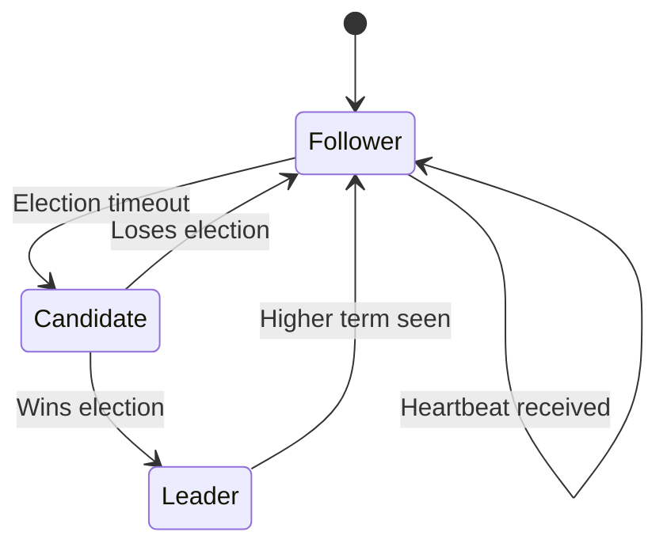
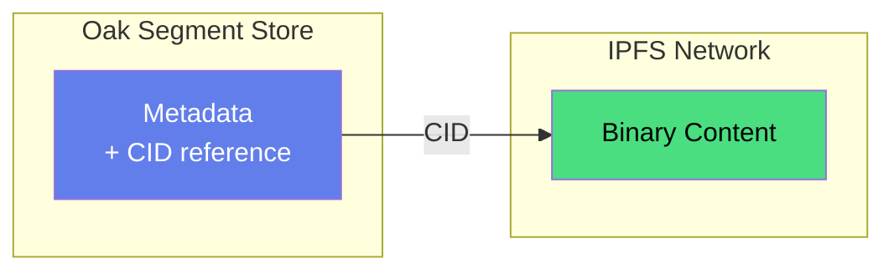

# Architecture

Oak Chain is a distributed content repository that bridges Ethereum's economic security with Oak's enterprise content model.

## Two Deployment Models

Oak Chain supports two distinct integration patterns, each optimized for different use cases and existing infrastructure.

**Why two models?** We asked: What are the fundamental constraints?

- **Constraint 1**: New apps don't need AEM's complexity → SDK model
- **Constraint 2**: Existing AEM customers can't migrate → Connector model
- **Constraint 3**: Both need the same validator infrastructure → Shared architecture

We didn't force one model. We optimized for utility × impact: SDK for new projects (high impact potential), Connector for existing AEM (high utility for entrenched users).

<FlowGraph flow="two-models" :height="340" />

<div class="model-card">

### Model 1: Blockchain-Native Applications (Top Flow)

**For**: New applications built from scratch or modern web/mobile apps

<div class="integration-path">
**Integration Path**: `Application → Oak Chain SDK → Validators → Ethereum`
</div>

**How it works**:
- Applications use the **Oak Chain SDK** (JavaScript/TypeScript) to interact with validators
- SDK provides REST API client, wallet integration, and payment handling
- Content writes go directly to validators via HTTPS API
- Validators verify Ethereum payments and replicate via Raft consensus
- **Example**: EDS (aem.live), React apps, Next.js sites, mobile apps

**Best for**: 
- New projects without existing AEM infrastructure
- Modern JavaScript/TypeScript applications
- Edge Delivery Services (EDS) deployments
- Headless CMS architectures

</div>

<div class="model-card">

### Model 2: AEM Integration (Bottom Flow)

**For**: Existing Adobe Experience Manager customers

<div class="integration-path">
**Integration Path**: `AEM → Oak Chain Connector → Validators → Ethereum`
</div>

**How it works**:
- **Oak Chain Connector** installs as an AEM package (OSGi bundle)
- Uses Oak's **composite mount** pattern to mount `/oak-chain` read-only
- AEM authors continue using familiar JCR API and Sling patterns
- Connector handles HTTP segment transfer and wallet services
- Validators serve Oak segments via `oak-segment-http` module
- **Example**: Existing AEM 6.5, AEM Cloud Service, or custom Oak deployments

**Best for**:
- Organizations already running AEM
- Teams familiar with JCR/Sling APIs
- Migrating existing content to blockchain-backed storage
- Maintaining AEM workflows while adding blockchain provenance

</div>

<div class="shared-architecture">

### Shared Architecture

Both models share the same validator cluster and storage layer:

- **Validators**: Raft consensus cluster storing Oak segments
- **Ethereum**: Payment verification and economic security
- **IPFS**: Binary storage (validators store CIDs only, 46 bytes each)
- **Author IPFS**: Binaries live at the author's source, not in validators

</div>

<div class="key-insight">

**Key insight**: Validators store **CIDs only** (46 bytes), not binaries. Binaries live at the author's source, enabling decentralized storage while keeping validator storage costs minimal.

</div>

<div class="diagram-explanation">

### Understanding the Diagram

The diagram above shows both integration models side-by-side:

- **Top flow (Model 1)**: Shows blockchain-native applications (EDS) connecting directly to validators via HTTPS API
- **Bottom flow (Model 2)**: Shows existing AEM systems mounting Oak Chain via HTTP segment transfer
- **"Model 1" and "Model 2" labels**: These are visual labels identifying each integration pattern, not functional components in the data flow
- **Shared IPFS node**: Both models reference the same Author IPFS storage for binaries

Both models converge at the same validator cluster and Ethereum layer—the difference is in how applications connect to Oak Chain.

</div>

---

## The Five Layers

```
┌─────────────────────────────────────────────────────────────┐
│  Layer 5: Visual Abstraction (Future)                       │
│  Pretty names → wallet addresses                            │
├─────────────────────────────────────────────────────────────┤
│  Layer 4: Payment                                           │
│  One wallet per cluster, ETH payments                       │
├─────────────────────────────────────────────────────────────┤
│  Layer 3: Cross-Cluster Reads                               │
│  Composite mounts, HTTP segment transfer                    │
├─────────────────────────────────────────────────────────────┤
│  Layer 2: Cluster Authority                                 │
│  Deterministic sharding by wallet hash                      │
├─────────────────────────────────────────────────────────────┤
│  Layer 1: Content Ownership                                 │
│  Wallet address = namespace                                 │
└─────────────────────────────────────────────────────────────┘
```

<div class="layer-section">

## Layer 1: Content Ownership

**Wallet address IS the namespace.**

```
/oak-chain/{L1}/{L2}/{L3}/0x{wallet}/{organization}/content/...
```

- `{L1}/{L2}/{L3}` - First 6 hex chars of wallet (e.g., `74/2d/35`)
- `0x{wallet}` - Full Ethereum wallet address (owner)
- `{organization}` - Optional organization/brand scope
- `content/` - Standard AEM content root within each scope

**Example:**
```
/oak-chain/74/2d/35/0x742d35Cc6634c0532925a3b844bc9e7595f0beb/
    ├── PixelPirates/content/       ← Gaming brand
    ├── CryptoKitchenware/content/  ← eCommerce brand
    └── PersonalBlog/content/       ← Personal content
```

Only the wallet owner can write to their namespace. Self-sovereign, no central authority.

</div>

<div class="layer-section">

## Layer 2: Cluster Authority

**Deterministic sharding by wallet hash.**

```java
int shard = hash(walletAddress) & 0xFFF;  // 12-bit = 4096 shards
Cluster cluster = shardToCluster(shard);
```

Each cluster is authoritative (read-write) for its shard range. Sharding is by **wallet**, not by organization name.

</div>

<div class="layer-section">

## Layer 3: Cross-Cluster Reads

**Composite mounts for global content graph.**

Every cluster READ-ONLY mounts all other clusters via HTTP segment transfer. This enables:
- Global content discovery
- Cross-organization references
- Local write authority with global reads

</div>

<div class="layer-section">

## Layer 4: Payment

**One wallet per cluster.**

- Cluster = economic unit
- Internal node distribution is off-chain
- Payment verification via Ethereum smart contract

</div>

<div class="layer-section">

## Layer 5: Visual Abstraction (Future)

**Pretty names for wallet addresses.**

- "Adobe" → `0xADOBE_CORP...`
- Cosmetic only, doesn't affect storage
- Deferred feature

</div>

---

## Consensus Model

Oak Chain uses **Aeron Cluster** for Raft-based consensus.



### Key Properties

| Property | Value |
|----------|-------|
| Consensus | Raft (leader-based) |
| Implementation | Aeron Cluster |
| Failover | < 5 seconds |
| Replication | Synchronous |
| State Machine | Deterministic |

### Write Flow

1. Client sends write proposal to any validator
2. Non-leaders redirect to leader
3. Leader validates Ethereum payment
4. Leader proposes to Aeron cluster
5. Followers acknowledge
6. Leader commits to Oak segment store
7. Leader responds to client

---

## Storage Architecture

**Why Oak segments?** When told "you can't scale Oak to planetary scale," we asked "why?"

The answer: You can. Oak segments are immutable, append-only, and content-addressed. The constraint isn't physics—it's engineering. We optimized for what matters: TB-scale segment stores, lazy segment fetching, hierarchical GC. The "impossible" became tractable by breaking down to fundamentals.

### Oak Segments

Content stored in Oak's TAR segment format:
- Immutable segments
- Append-only journal
- Cryptographic checksums
- JCR API compatibility

### IPFS Binaries

Large binaries stored in IPFS:
- Content-addressed (CID)
- Validators store CIDs in Oak
- Authors own binary storage
- Direct binary access pattern



---

## HTTP Segment Transfer

Any Oak-based system can mount Oak Chain read-only via **Oak Chain Connector** (for AEM) or **Oak Chain SDK** (for other applications):

<FlowGraph flow="aem-integration" :height="280" />

**Supported platforms**:
- Adobe Experience Manager (on-prem, AMS, AEMaaCS)
- Apache Sling
- Other Oak-based CMS/CRM systems

This enables horizontal read scaling without consensus overhead. See the [AEM Integration Guide](/guide/aem-integration) for setup instructions.

---

## Economic Model

### Three Tiers

| Tier | Latency | Price | Use Case |
|------|---------|-------|----------|
| **PRIORITY** | ~30s | 0.00001 ETH | Breaking news, urgent updates |
| **EXPRESS** | ~6.4min | 0.000002 ETH | Standard publishing |
| **STANDARD** | ~12.8min | 0.000001 ETH | Batch operations, archives |

### Payment Flow

1. Author pays smart contract
2. Transaction recorded in Ethereum epoch
3. Validator verifies payment via Beacon Chain API
4. Write proceeds after verification

PRIORITY tier bypasses epoch batching for lowest latency.

---

## Next Steps

- [Run a Validator](/operators/) - Join the network
- [Quick Start](/guide/) - Get running locally
- [FAQ](/faq) - Common questions answered