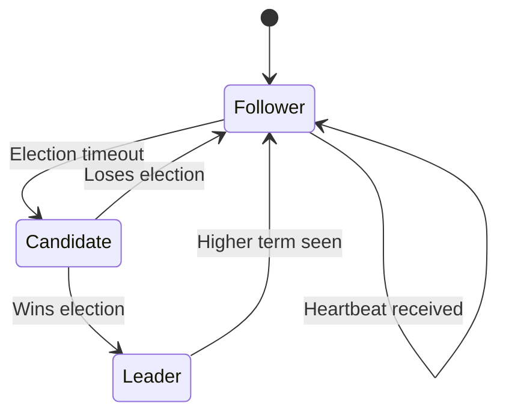
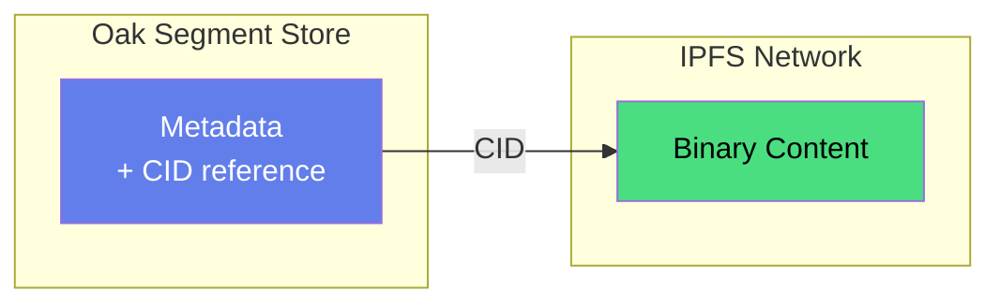

# Architecture

Oak Chain is a distributed content repository that bridges Ethereum's economic security with Oak's enterprise content model.

## Two Deployment Models

Oak Chain supports two integration patterns for different use cases:

<FlowGraph flow="two-models" :height="340" />

| Model | Use Case | Integration Path |
|-------|----------|------------------|
| **AEM Integration** | Existing AEM customers | AEM → Oak Chain Connector → Validators → Ethereum |
| **Other Services** | EDS, web apps, mobile apps, etc. | Application → Oak Chain SDK → Validators → Ethereum |

**Key insight**: Validators store **CIDs only** (46 bytes), not binaries. Binaries live at the author's source.

---

## The Five Layers

```
┌─────────────────────────────────────────────────────────────┐
│  Layer 5: Visual Abstraction (Future)                       │
│  Pretty names → wallet addresses                            │
├─────────────────────────────────────────────────────────────┤
│  Layer 4: Payment                                           │
│  One wallet per cluster, ETH payments                       │
├─────────────────────────────────────────────────────────────┤
│  Layer 3: Cross-Cluster Reads                               │
│  Composite mounts, HTTP segment transfer                    │
├─────────────────────────────────────────────────────────────┤
│  Layer 2: Cluster Authority                                 │
│  Deterministic sharding by wallet hash                      │
├─────────────────────────────────────────────────────────────┤
│  Layer 1: Content Ownership                                 │
│  Wallet address = namespace                                 │
└─────────────────────────────────────────────────────────────┘
```

## Layer 1: Content Ownership

**Wallet address IS the namespace.**

```
/oak-chain/{L1}/{L2}/{L3}/0x{wallet}/{organization}/content/...
```

- `{L1}/{L2}/{L3}` - First 6 hex chars of wallet (e.g., `74/2d/35`)
- `0x{wallet}` - Full Ethereum wallet address (owner)
- `{organization}` - Optional organization/brand scope
- `content/` - Standard AEM content root within each scope

**Example:**
```
/oak-chain/74/2d/35/0x742d35Cc6634c0532925a3b844bc9e7595f0beb/
    ├── PixelPirates/content/       ← Gaming brand
    ├── CryptoKitchenware/content/  ← eCommerce brand
    └── PersonalBlog/content/       ← Personal content
```

Only the wallet owner can write to their namespace. Self-sovereign, no central authority.

## Layer 2: Cluster Authority

**Deterministic sharding by wallet hash.**

```java
int shard = hash(walletAddress) & 0xFFF;  // 12-bit = 4096 shards
Cluster cluster = shardToCluster(shard);
```

Each cluster is authoritative (read-write) for its shard range. Sharding is by **wallet**, not by organization name.

## Layer 3: Cross-Cluster Reads

**Composite mounts for global content graph.**

Every cluster READ-ONLY mounts all other clusters via HTTP segment transfer. This enables:
- Global content discovery
- Cross-organization references
- Local write authority with global reads

## Layer 4: Payment

**One wallet per cluster.**

- Cluster = economic unit
- Internal node distribution is off-chain
- Payment verification via Ethereum smart contract

## Layer 5: Visual Abstraction (Future)

**Pretty names for wallet addresses.**

- "Adobe" → `0xADOBE_CORP...`
- Cosmetic only, doesn't affect storage
- Deferred feature

---

## Consensus Model

Oak Chain uses **Aeron Cluster** for Raft-based consensus.



### Key Properties

| Property | Value |
|----------|-------|
| Consensus | Raft (leader-based) |
| Implementation | Aeron Cluster |
| Failover | < 5 seconds |
| Replication | Synchronous |
| State Machine | Deterministic |

### Write Flow

1. Client sends write proposal to any validator
2. Non-leaders redirect to leader
3. Leader validates Ethereum payment
4. Leader proposes to Aeron cluster
5. Followers acknowledge
6. Leader commits to Oak segment store
7. Leader responds to client

---

## Storage Architecture

### Oak Segments

Content stored in Oak's TAR segment format:
- Immutable segments
- Append-only journal
- Cryptographic checksums
- JCR API compatibility

### IPFS Binaries

Large binaries stored in IPFS:
- Content-addressed (CID)
- Validators store CIDs in Oak
- Authors own binary storage
- Direct binary access pattern



---

## HTTP Segment Transfer

Any Oak-based system can mount Oak Chain read-only via **Oak Chain Connector** (for AEM) or **Oak Chain SDK** (for other applications):

<FlowGraph flow="aem-integration" :height="280" />

**Supported platforms**:
- Adobe Experience Manager (on-prem, AMS, AEMaaCS)
- Apache Sling
- Other Oak-based CMS/CRM systems

This enables horizontal read scaling without consensus overhead. See the [AEM Integration Guide](/guide/aem-integration) for setup instructions.

---

## Economic Model

### Three Tiers

| Tier | Latency | Price | Use Case |
|------|---------|-------|----------|
| **PRIORITY** | ~30s | 0.00001 ETH | Breaking news, urgent updates |
| **EXPRESS** | ~6.4min | 0.000002 ETH | Standard publishing |
| **STANDARD** | ~12.8min | 0.000001 ETH | Batch operations, archives |

### Payment Flow

1. Author pays smart contract
2. Transaction recorded in Ethereum epoch
3. Validator verifies payment via Beacon Chain API
4. Write proceeds after verification

PRIORITY tier bypasses epoch batching for lowest latency.

---

## Next Steps

- [Run a Validator](/operators/) - Join the network
- [Quick Start](/guide/) - Get running locally
- [FAQ](/faq) - Common questions answered