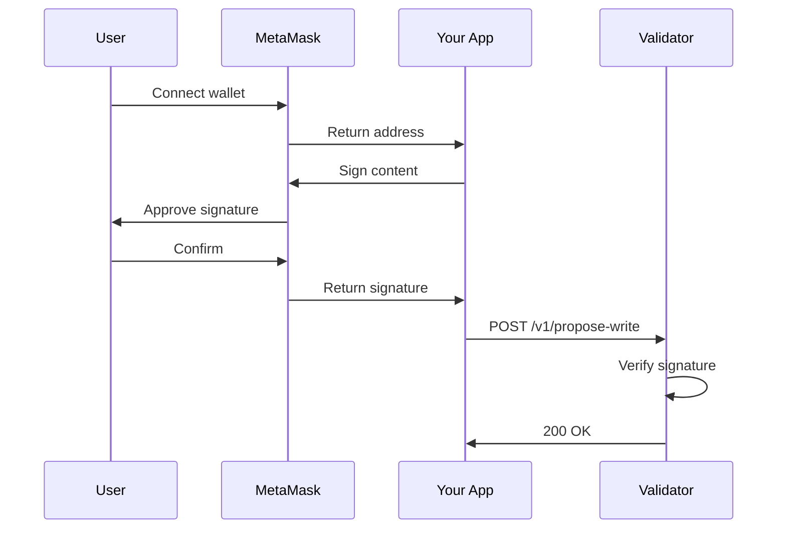

# Authentication

Oak Chain uses Ethereum wallets for identity and authorization.

## Overview



## Wallet Connection

### MetaMask (Browser)

```javascript
// Check if MetaMask is installed
if (typeof window.ethereum === 'undefined') {
  alert('Please install MetaMask');
  return;
}

// Request account access
const accounts = await window.ethereum.request({
  method: 'eth_requestAccounts'
});

const wallet = accounts[0];
console.log('Connected:', wallet);
// 0x742d35Cc6634c0532925a3b844bc9e7595f0beb
```

### WalletConnect (Mobile)

```javascript
import WalletConnect from '@walletconnect/client';
import QRCodeModal from '@walletconnect/qrcode-modal';

const connector = new WalletConnect({
  bridge: 'https://bridge.walletconnect.org',
  qrcodeModal: QRCodeModal,
});

if (!connector.connected) {
  await connector.createSession();
}

const wallet = connector.accounts[0];
```

## Signing Content

Every write must be signed by your wallet to prove ownership.

### What Gets Signed

```javascript
const message = JSON.stringify({
  path: 'content/pages/hello',
  content: { title: 'Hello!' },
  timestamp: Date.now(),
  nonce: crypto.randomUUID(),
});
```

### Sign with MetaMask

```javascript
async function signContent(wallet, content, path) {
  const message = JSON.stringify({
    path,
    content,
    timestamp: Date.now(),
    nonce: crypto.randomUUID(),
  });
  
  const signature = await window.ethereum.request({
    method: 'personal_sign',
    params: [message, wallet],
  });
  
  return { message, signature };
}

// Usage
const { message, signature } = await signContent(
  wallet,
  { title: 'Hello!' },
  'content/pages/hello'
);
```

### Sign with ethers.js

```javascript
import { ethers } from 'ethers';

const provider = new ethers.BrowserProvider(window.ethereum);
const signer = await provider.getSigner();

const message = JSON.stringify({
  path: 'content/pages/hello',
  content: { title: 'Hello!' },
  timestamp: Date.now(),
});

const signature = await signer.signMessage(message);
```

## Complete Write Flow

```javascript
async function writeContent(organization, content, tier, txHash) {
  // 1. Get wallet
  const accounts = await window.ethereum.request({
    method: 'eth_requestAccounts'
  });
  const wallet = accounts[0];
  
  // 2. Sign content
  const message = JSON.stringify({ content, timestamp: Date.now() });
  
  const signature = await window.ethereum.request({
    method: 'personal_sign',
    params: [message, wallet],
  });
  
  // 3. Submit to validator
  const response = await fetch('http://localhost:8090/v1/propose-write', {
    method: 'POST',
    headers: { 'Content-Type': 'application/x-www-form-urlencoded' },
    body: new URLSearchParams({
      walletAddress: wallet,
      organization,
      message,
      paymentTier: tier,
      ethereumTxHash: txHash,
      signature,
    }),
  });
  
  return response.json();
}

// Usage
const result = await writeContent(
  'MyBrand',
  { title: 'Hello World!' },
  'express',
  '0x...'
);
```

## Signature Verification

Validators verify signatures using ecrecover:

```java
// Server-side verification (Java)
public boolean verifySignature(String message, String signature, String wallet) {
    byte[] messageHash = Hash.sha3(
        ("\u0019Ethereum Signed Message:\n" + message.length() + message).getBytes()
    );
    
    Sign.SignatureData sig = Sign.signatureDataFromHex(signature);
    BigInteger publicKey = Sign.signedMessageHashToKey(messageHash, sig);
    String recoveredAddress = Keys.getAddress(publicKey);
    
    return wallet.equalsIgnoreCase("0x" + recoveredAddress);
}
```

## Authorization Rules

| Action | Requirement |
|--------|-------------|
| **Read** | None (public) |
| **Write** | Wallet signature + payment |
| **Delete** | Wallet signature + payment + ownership |

### Path Ownership

You can only write to paths under your wallet:

```
✅ /oak-chain/74/2d/35/0xYOUR_WALLET/...
❌ /oak-chain/ab/cd/ef/0xOTHER_WALLET/...
```

## Security Best Practices

1. **Never expose private keys** - Use MetaMask or hardware wallets
2. **Verify domain** - Check you're signing for the correct site
3. **Review content** - Read what you're signing before confirming
4. **Use nonces** - Prevent replay attacks
5. **Timestamp messages** - Reject old signatures

## Next Steps

- [API Reference](/guide/api) - Full endpoint documentation
- [Economic Tiers](/guide/economics) - Payment integration
- [Quick Start](/guide/) - Get running locally
