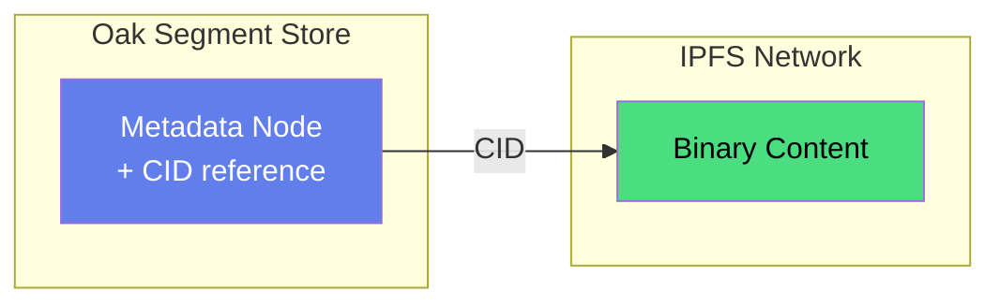

# Binary Storage

Oak Chain stores large binaries in IPFS, with CID references in Oak. Validators store **CIDs only** (46 bytes), not the binaries themselves.

## The Truth → Provenance → Edge Flow

This is the beautiful insight: Oak Chain is the **source of truth** (CIDs), while binaries flow through author storage to edge CDNs.

<FlowGraph flow="binary-flow" :height="300" />

### How It Works

1. **Oak Chain** stores the CID (content-addressed hash) — this is the **truth**
2. **Author** hosts the binary (IPFS, Azure Blob, or pinning service) — this is **provenance**
3. **Edge CDN** caches the binary globally (Cloudflare R2, Fastly) — this is **delivery**
4. **User** can verify binary integrity by hashing and comparing to the CID

### Why This Is Beautiful

| Property | Benefit |
|----------|---------|
| **Immutable provenance** | CID in Oak Chain proves what the binary SHOULD be |
| **Decentralized truth** | Validators consensus on CID, not on binary storage |
| **Perfect cache key** | CID never changes = CDN can cache forever |
| **Trustless verification** | Anyone can hash binary and compare to Oak Chain CID |
| **Economic separation** | Validators handle consensus, authors handle storage, CDN handles delivery |

---

## Architecture



## Why IPFS?

| Benefit | Description |
|---------|-------------|
| **Content-addressed** | CID = hash of content, immutable |
| **Decentralized** | No single point of failure |
| **Deduplication** | Same content = same CID |
| **Author-owned** | Authors control their storage |

## How It Works

### 1. Author Uploads to IPFS

```bash
# Upload binary to IPFS
ipfs add my-image.jpg
# Returns: QmXyz...abc (CID)
```

### 2. Author Writes CID to Oak

```bash
curl -X POST http://localhost:8090/v1/propose-write \
  -H "Content-Type: application/json" \
  -d '{
    "wallet": "0x742d35Cc...",
    "organization": "PixelPirates",
    "path": "content/dam/images/hero",
    "content": {
      "jcr:primaryType": "dam:Asset",
      "jcr:content": {
        "renditions": {
          "original": {
            "ipfs:cid": "QmXyz...abc",
            "jcr:mimeType": "image/jpeg",
            "size": 1048576
          }
        }
      }
    },
    "paymentTier": "express",
    "txHash": "0x..."
  }'
```

### 3. Readers Fetch from IPFS

```bash
# Get metadata from Oak
curl http://localhost:8090/api/content/oak-chain/.../content/dam/images/hero

# Response includes CID
{
  "renditions": {
    "original": {
      "ipfs:cid": "QmXyz...abc",
      ...
    }
  }
}

# Fetch binary from IPFS gateway
curl https://ipfs.io/ipfs/QmXyz...abc > image.jpg
```

## Direct Binary Access

For performance, use direct IPFS access:

```javascript
async function getAsset(path) {
  // 1. Get metadata from Oak
  const meta = await fetch(`http://validator:8090/api/content${path}`);
  const { renditions } = await meta.json();
  
  // 2. Get binary from IPFS (direct, no validator)
  const cid = renditions.original['ipfs:cid'];
  const binary = await fetch(`https://ipfs.io/ipfs/${cid}`);
  
  return binary.blob();
}
```

## Storage Model

### Validators Store CIDs Only

```
Validator Storage:
├── Oak Segments (structured content + CIDs)
└── NO binary blobs
```

### Authors Own Binaries

Authors are responsible for:
- Uploading to IPFS
- Pinning (ensuring availability)
- Paying for IPFS storage (Filecoin, Pinata, etc.)

This separates:
- **Consensus** (validators) - structured content
- **Storage** (IPFS) - binary blobs

## Pinning Services

| Service | Description |
|---------|-------------|
| [Pinata](https://pinata.cloud) | Managed IPFS pinning |
| [Infura IPFS](https://infura.io/product/ipfs) | Enterprise IPFS |
| [Filecoin](https://filecoin.io) | Decentralized storage deals |
| [web3.storage](https://web3.storage) | Free tier available |

## Example: Image Upload Flow

```javascript
import { create } from 'ipfs-http-client';

const ipfs = create({ url: 'https://ipfs.infura.io:5001' });

async function uploadImage(file, wallet, org) {
  // 1. Upload to IPFS
  const { cid } = await ipfs.add(file);
  console.log('IPFS CID:', cid.toString());
  
  // 2. Write metadata to Oak
  const response = await fetch('http://validator:8090/v1/propose-write', {
    method: 'POST',
    headers: { 'Content-Type': 'application/json' },
    body: JSON.stringify({
      wallet,
      organization: org,
      path: `content/dam/uploads/${file.name}`,
      content: {
        'jcr:primaryType': 'dam:Asset',
        'ipfs:cid': cid.toString(),
        'jcr:mimeType': file.type,
        'size': file.size,
        'uploadedAt': new Date().toISOString()
      },
      paymentTier: 'express',
      txHash: '0x...' // From payment
    })
  });
  
  return { cid: cid.toString(), oakPath: response.path };
}
```

## Garbage Collection

When content is deleted from Oak:
1. CID reference removed from Oak
2. Binary remains in IPFS (content-addressed)
3. Author can unpin if no longer needed
4. IPFS GC eventually removes unpinned content

## Next Steps

- [Content Paths](/guide/paths) - Path structure
- [Streaming](/guide/streaming) - Real-time events
