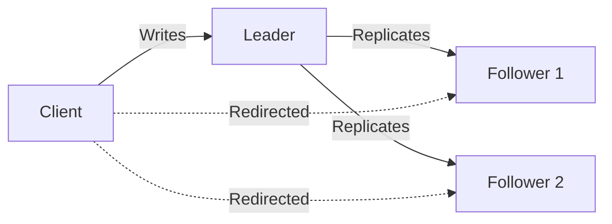
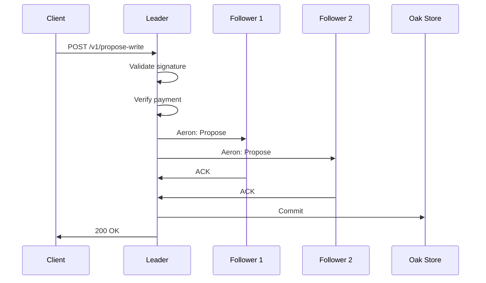

# Consensus Model

Oak Chain uses **Aeron Cluster** for Raft-based distributed consensus.

## Why This Matters

Consensus is the difference between a single-node demo and a system that can survive failures without corrupting shared state.

## What You'll Prove

- You understand leader, follower, and candidate behavior during normal operations and failover.
- You can trace how a write moves from proposal to quorum commit.
- You can reason about failover timing and operational impact.

## Next Action

Read the role and write-path diagrams first, then run a local cluster and observe leader behavior using the status endpoints.

## Why Aeron?

| Requirement | Aeron Solution |
|-------------|----------------|
| Low latency | Kernel-bypass networking |
| Deterministic | Replay-based state machine |
| Proven | Used in production at scale |
| Failover | Sub-5-second leader election |

## How It Works

### Roles



- **Leader**: Accepts writes, proposes to cluster
- **Follower**: Replicates state, redirects writes to leader
- **Candidate**: Temporary state during election

### Write Path



### Leader Election

When the leader fails:

1. Followers detect missing heartbeats (election timeout)
2. One follower becomes **candidate**
3. Candidate requests votes from peers
4. Majority vote → new **leader**
5. New leader resumes operations

**Failover time**: < 5 seconds

## Deterministic State Machine

All validators execute the same operations in the same order:

```java
// Every validator runs this identically
public void onSessionMessage(ClientSession session, 
                              long timestamp, 
                              DirectBuffer buffer) {
    WriteProposal proposal = decode(buffer);
    
    // Deterministic: same input → same output
    nodeStore.merge(proposal.path, proposal.content);
    
    // All validators now have identical state
}
```

**Key property**: Given the same log, all validators produce identical Oak segment stores.

## Configuration

### Cluster Members

```yaml
# docker-compose.yml
services:
  validator-0:
    environment:
      - AERON_CLUSTER_MEMBER_ID=0
      - AERON_CLUSTER_MEMBERS=0,localhost:20000,localhost:20001,localhost:20002|1,localhost:20010,localhost:20011,localhost:20012|2,localhost:20020,localhost:20021,localhost:20022
```

### Timeouts

| Parameter | Default | Description |
|-----------|---------|-------------|
| `election.timeout.ms` | 1000 | Time before follower starts election |
| `heartbeat.interval.ms` | 200 | Leader heartbeat frequency |
| `session.timeout.ms` | 5000 | Client session timeout |

## Failure Scenarios

### Leader Failure

1. Followers detect timeout
2. Election occurs
3. New leader elected
4. Clients reconnect automatically

### Follower Failure

1. Leader continues with remaining quorum
2. Failed follower rejoins via snapshot
3. Catches up from log

### Network Partition

1. Minority partition cannot elect leader
2. Majority partition continues
3. Minority rejects writes (no quorum)
4. Heals automatically when network recovers

## Monitoring

### Key Metrics

```bash
# Cluster state
curl http://localhost:8090/v1/aeron/cluster-state

# Response
{
  "role": "LEADER",
  "leadershipTermId": 42,
  "clusterMemberCount": 3,
  "members": [
    {"memberId": 0, "role": "LEADER"},
    {"memberId": 1, "role": "FOLLOWER"},
    {"memberId": 2, "role": "FOLLOWER"}
  ]
}
```

### Prometheus Metrics

| Metric | Description |
|--------|-------------|
| `aeron_cluster_role` | Current role (0=follower, 1=candidate, 2=leader) |
| `aeron_cluster_term` | Current Raft term |
| `aeron_cluster_commit_index` | Committed log index |
| `aeron_cluster_election_count` | Number of elections |

## Next Steps

- [Economic Tiers](/guide/economics) - Payment and finality
- [Run a Validator](/operators/) - Join the network
