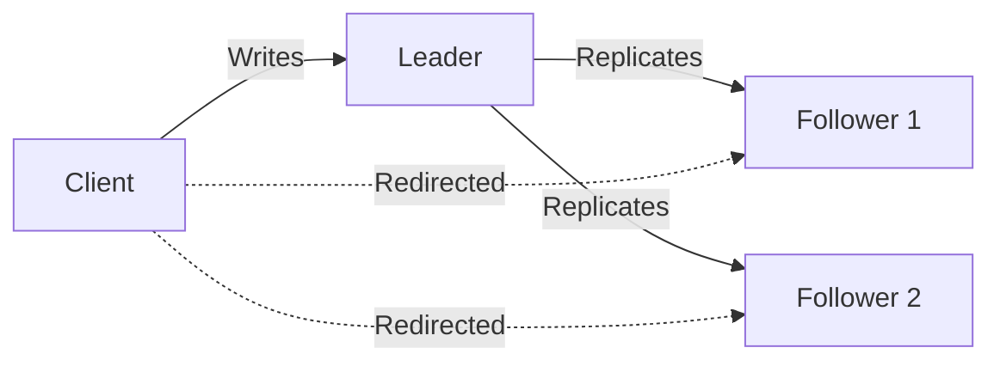
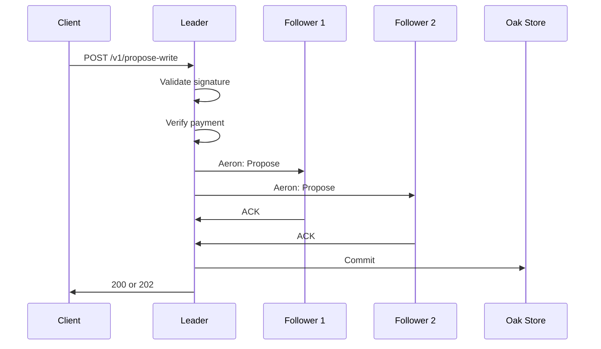

# Consensus Model

Oak Chain uses **Aeron Cluster** for Raft-based distributed consensus.

## Why This Matters

Consensus is the difference between a single-node demo and a system that can survive failures without corrupting shared state.

## What You'll Prove

- You understand leader, follower, and candidate behavior during normal operations and failover.
- You can trace how a write moves from proposal to quorum commit.
- You can reason about which consensus surfaces are source truth, which are local diagnosis, and which are upstream composition.

## Next Action

Read the role and write-path diagrams first, then query the source routes before you look at any local diagnostic or upstream views.

## Contract Boundary

Consensus truth starts at the validator-native source routes.

Use `/v1/consensus/leader` and `/v1/consensus/status` for normalized leader and role state.

Use `/v1/ops/snapshots/{cluster,queue,replication,runtime}` for governed consensus-adjacent observability.

Treat `/v1/aeron/*` and `/health/deep` as local diagnostic detail.

Treat `/ops/v1/*` as the edge-owned remote contract built from source routes, not as a second consensus engine.

## Why Aeron?

| Requirement | Aeron Solution |
|-------------|----------------|
| Low latency | Kernel-bypass networking |
| Deterministic | Replay-based state machine |
| Proven | Used in production at scale |
| Failover | Sub-5-second leader election |

## How It Works

### Roles


```mermaid
graph LR
    L[Leader] -->|Replicates| F1[Follower 1]
    L -->|Replicates| F2[Follower 2]
    C[Client] -->|Writes| L
    C -.->|Redirected| F1
    C -.->|Redirected| F2
```

- **Leader**: Accepts writes, proposes to cluster, and publishes normalized leader state.
- **Follower**: Replays the same ordered log and can expose the same source status routes.
- **Candidate**: Temporary election role during leadership transfer.

### Write Path


```mermaid
sequenceDiagram
    participant C as Client
    participant L as Leader
    participant F1 as Follower 1
    participant F2 as Follower 2
    participant Oak as Oak Store

    C->>L: POST /v1/propose-write
    L->>L: Validate signature
    L->>L: Verify payment
    L->>F1: Aeron: Propose
    L->>F2: Aeron: Propose
    F1->>L: ACK
    F2->>L: ACK
    L->>Oak: Commit
    L->>C: 200 or 202
```

### Leader Election

When the leader fails:

1. Followers detect missing heartbeats.
2. One follower becomes **candidate**.
3. The candidate requests votes from peers.
4. A majority vote elects the new **leader**.
5. Source routes converge on the new leader, and the edge contract follows them.

**Failover time**: typically under five seconds in the current Aeron configuration.

## Deterministic State Machine

All validators execute the same operations in the same order.

```java
public void onSessionMessage(ClientSession session,
                             long timestamp,
                             DirectBuffer buffer) {
    WriteProposal proposal = decode(buffer);
    nodeStore.merge(proposal.path, proposal.content);
}
```

Given the same replicated log, validators converge on the same Oak segment-store state.

## Observation Order

### 1. Source Truth

Use these first when you need authoritative consensus state from the validator.

```bash
curl -s http://127.0.0.1:8090/v1/consensus/leader | jq .
curl -s http://127.0.0.1:8090/v1/consensus/status | jq .
curl -s http://127.0.0.1:8090/v1/ops/snapshots/cluster | jq .
curl -s http://127.0.0.1:8090/v1/ops/snapshots/queue | jq .
curl -s http://127.0.0.1:8090/v1/ops/snapshots/replication | jq .
```

### 2. Local Diagnosis

Use these only when the normalized source routes are not enough.

```bash
curl -s http://127.0.0.1:8090/v1/aeron/cluster-state | jq .
curl -s http://127.0.0.1:8090/v1/aeron/raft-metrics | jq .
curl -s http://127.0.0.1:8090/v1/aeron/node-status?nodeId=0 | jq .
curl -s http://127.0.0.1:8090/v1/aeron/replication-lag | jq .
```

### 3. Canonical Upstream

Use these for remote dashboards, operators, and product-facing read models.

```bash
curl -s http://127.0.0.1:8787/ops/v1/cluster | jq .
curl -s http://127.0.0.1:8787/ops/v1/queue | jq .
curl -s http://127.0.0.1:8787/ops/v1/replication | jq .
curl -s http://127.0.0.1:8787/ops/v1/durability | jq .
curl -s http://127.0.0.1:8787/ops/v1/finality | jq .
```

## Configuration

### Cluster Members

```bash
export AERON_CLUSTER_MEMBER_ID=0
export AERON_CLUSTER_MEMBERS=0,localhost:20000,localhost:20001,localhost:20002|1,localhost:20010,localhost:20011,localhost:20012|2,localhost:20020,localhost:20021,localhost:20022
```

### Timeouts

| Parameter | Default | Description |
|-----------|---------|-------------|
| `election.timeout.ms` | 1000 | Time before a follower starts an election |
| `heartbeat.interval.ms` | 200 | Leader heartbeat frequency |
| `session.timeout.ms` | 5000 | Client session timeout |

## Failure Scenarios

### Leader Failure

1. Followers detect timeout.
2. Election occurs.
3. A new leader is elected.
4. Source routes converge, and the edge contract follows the new leader.

### Follower Failure

1. The leader continues with the remaining quorum.
2. The failed follower rejoins via snapshot and replay.
3. Local diagnostic routes can show lag during catch-up, but source snapshots stay the primary contract.

### Network Partition

1. The minority partition cannot elect a leader.
2. The majority partition continues.
3. The minority rejects writes because quorum is unavailable.
4. Source routes and edge composition recover once the partition heals.

## Monitoring

Use `/v1/consensus/leader` for normalized leader lookup.

Use `/v1/ops/snapshots/runtime` for governed runtime state.

Use `/v1/aeron/*` only when you need raw local diagnostic detail.

```bash
curl -s http://localhost:8090/v1/consensus/leader | jq .
curl -s http://localhost:8090/v1/ops/snapshots/runtime | jq .
curl -s http://localhost:8090/v1/ops/snapshots/queue | jq .
```

### Prometheus Metrics

| Metric | Description |
|--------|-------------|
| `aeron_cluster_role` | Current role |
| `aeron_cluster_term` | Current Raft term |
| `aeron_cluster_commit_index` | Committed log index |
| `aeron_cluster_election_count` | Number of elections |

## Next Steps

- [Proposal Flow](/guide/proposal-flow)
- [Primary Signals](/guide/primary-signals)
- [Run a Validator](/operators/)
