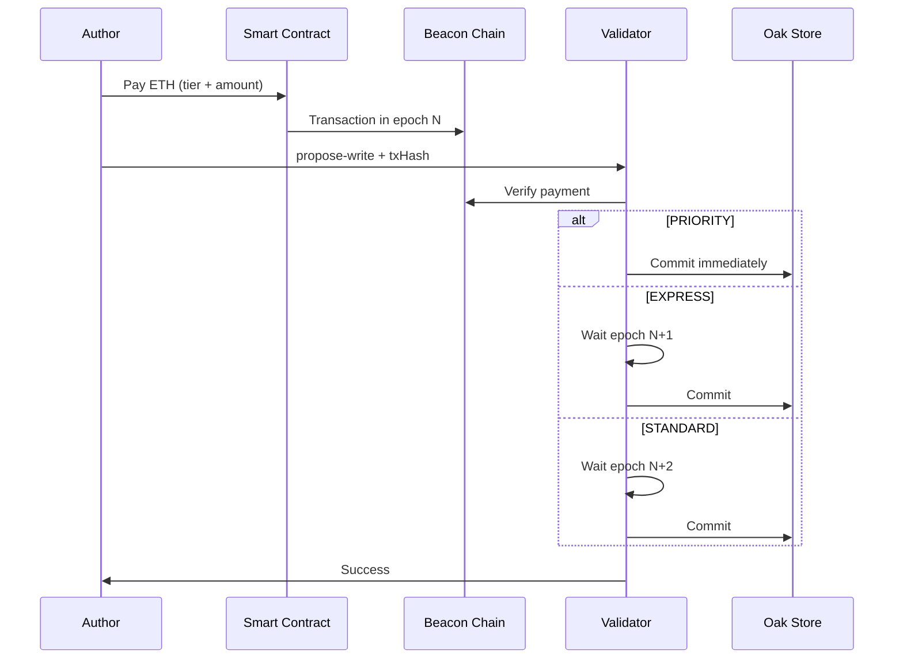

# Economic Tiers

Oak Chain uses Ethereum for economic security. Every write requires payment.

## Three Tiers

| Tier | Latency | Price | Epochs | Use Case |
|------|---------|-------|--------|----------|
| **PRIORITY** | ~30s | 0.00001 ETH | 0 (bypass) | Breaking news, urgent |
| **EXPRESS** | ~6.4min | 0.000002 ETH | 1 | Standard publishing |
| **STANDARD** | ~12.8min | 0.000001 ETH | 2 | Batch, archives |

## How It Works

### Ethereum Epochs

Ethereum finalizes in **epochs** (~6.4 minutes each):

```
Epoch N        Epoch N+1      Epoch N+2
├──────────────┼──────────────┼──────────────┤
│   Payment    │   Finality   │   Finality   │
│   submitted  │   (EXPRESS)  │   (STANDARD) │
```

- **PRIORITY**: Bypasses epoch batching entirely
- **EXPRESS**: Waits 1 epoch for finality
- **STANDARD**: Waits 2 epochs for maximum safety

### Payment Flow



## Choosing a Tier

### PRIORITY (~30s)

**When to use:**
- Breaking news
- Time-sensitive updates
- Real-time collaboration

**Trade-off:** Higher cost, lower finality guarantee

### EXPRESS (~6.4min)

**When to use:**
- Standard content publishing
- Most production workloads
- Balance of speed and cost

**Trade-off:** Good balance

### STANDARD (~12.8min)

**When to use:**
- Batch imports
- Archive operations
- Cost-sensitive workloads

**Trade-off:** Lowest cost, highest latency

## API Usage

```bash
# PRIORITY write
curl -X POST http://localhost:8090/v1/propose-write \
  -H "Content-Type: application/json" \
  -d '{
    "path": "/oak-chain/content/news/breaking",
    "content": "Breaking: ...",
    "wallet": "0x...",
    "signature": "0x...",
    "txHash": "0x...",
    "paymentTier": "priority"
  }'

# STANDARD write (default)
curl -X POST http://localhost:8090/v1/propose-write \
  -H "Content-Type: application/json" \
  -d '{
    "path": "/oak-chain/content/archive/2024",
    "content": "...",
    "wallet": "0x...",
    "signature": "0x...",
    "txHash": "0x...",
    "paymentTier": "standard"
  }'
```

## Smart Contract

The `ValidatorPaymentV3_1` contract handles payments:

```solidity
function pay(
    address validator,
    uint256 tier,  // 0=STANDARD, 1=EXPRESS, 2=PRIORITY
    bytes32 contentHash
) external payable {
    require(msg.value >= tierPrice[tier], "Insufficient payment");
    
    emit PaymentReceived(
        msg.sender,
        validator,
        tier,
        msg.value,
        contentHash,
        block.timestamp
    );
}
```

**Sepolia Contract**: `0x...` (testnet)

## Epoch Batching

For EXPRESS and STANDARD tiers, writes are batched by epoch:

```
Epoch N writes:
├── Write A (wallet 0x123, EXPRESS)
├── Write B (wallet 0x456, STANDARD)
└── Write C (wallet 0x789, EXPRESS)

Epoch N+1:
└── Commit Write A, Write C (EXPRESS)

Epoch N+2:
└── Commit Write B (STANDARD)
```

This reduces Aeron overhead by ~80% for batched writes.

## Monitoring

### Current Epoch

```bash
curl http://localhost:8090/v1/epoch

{
  "currentEpoch": 12345,
  "epochStartTime": "2024-01-10T12:00:00Z",
  "pendingWrites": {
    "priority": 0,
    "express": 5,
    "standard": 12
  }
}
```

### Payment Verification

```bash
curl http://localhost:8090/v1/verify-payment?txHash=0x...

{
  "verified": true,
  "tier": "express",
  "amount": "0.000002",
  "epoch": 12340
}
```

## Next Steps

- [Content Paths](/guide/paths) - Namespace structure
- [Run a Validator](/operators/) - Earn from payments
