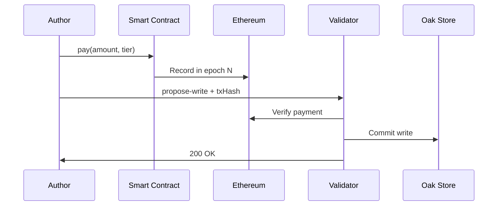

# Economic Tiers

Oak Chain uses Ethereum payments for economic security. Every write is backed by real value.

## Three Tiers

| Tier | Latency | Price | Use Case |
|------|---------|-------|----------|
| **PRIORITY** | ~30s | 0.00001 ETH | Breaking news, urgent updates |
| **EXPRESS** | ~6.4min | 0.000002 ETH | Standard publishing |
| **STANDARD** | ~12.8min | 0.000001 ETH | Batch operations, archives |

## How It Works



## Epoch-Based Finality

Oak Chain uses Ethereum's **epoch** system for finality:

- **Epoch**: 32 slots × 12 seconds = **6.4 minutes**
- **Finality**: 2 epochs = **~12.8 minutes**

### Why Epochs?

1. **Batching**: Multiple writes confirmed in one epoch check
2. **Efficiency**: One Beacon Chain query per epoch, not per write
3. **Security**: Ethereum's economic finality guarantees

## Tier Details

### PRIORITY (~30s)

```bash
curl -X POST http://localhost:8090/v1/propose-write \
  -H "Content-Type: application/x-www-form-urlencoded" \
  -d "walletAddress=0xWALLET" \
  -d "message=Breaking news..." \
  -d "contentType=page" \
  -d "paymentTier=priority" \
  -d "ethereumTxHash=0x..." \
  -d "signature=0x..."
```

- **Bypasses** epoch batching
- **Immediate** payment verification
- **Highest** cost
- **Use for**: Time-sensitive content

### EXPRESS (~6.4 minutes)

```bash
curl -X POST http://localhost:8090/v1/propose-write \
  -H "Content-Type: application/x-www-form-urlencoded" \
  -d "walletAddress=0xWALLET" \
  -d "message=Article content..." \
  -d "contentType=page" \
  -d "paymentTier=express" \
  -d "ethereumTxHash=0x..." \
  -d "signature=0x..."
```

- **Waits** for current epoch to finalize
- **Batched** with other EXPRESS writes
- **Balanced** cost/latency
- **Use for**: Normal publishing

### STANDARD (~12.8 minutes)

```bash
curl -X POST http://localhost:8090/v1/propose-write \
  -H "Content-Type: application/x-www-form-urlencoded" \
  -d "walletAddress=0xWALLET" \
  -d "message=Archive content..." \
  -d "contentType=page" \
  -d "paymentTier=standard" \
  -d "ethereumTxHash=0x..." \
  -d "signature=0x..."
```

- **Waits** for 2 epochs (full finality)
- **Maximum** batching efficiency
- **Lowest** cost
- **Use for**: Bulk imports, archives

## Smart Contract

### ValidatorPaymentV3_1

```solidity
// Sepolia: 0x...
// Mainnet: TBD

function pay(
    address validator,
    uint8 tier,
    bytes32 contentHash
) external payable {
    require(msg.value >= tierPrice[tier], "Insufficient payment");
    
    emit PaymentReceived(
        msg.sender,
        validator,
        tier,
        msg.value,
        contentHash,
        block.timestamp
    );
}
```

### Payment Verification

Validators verify payments by:

1. Querying Beacon Chain for epoch data
2. Checking `PaymentReceived` events in that epoch
3. Matching `txHash` to event
4. Verifying amount ≥ tier minimum

## Pricing Rationale

| Factor | Impact |
|--------|--------|
| **Ethereum gas** | Base cost for payment tx |
| **Validator compute** | Consensus + storage |
| **Replication** | 3+ copies across network |
| **Finality guarantee** | Economic security |

Prices are set to:
- Cover validator operating costs
- Discourage spam
- Remain accessible for legitimate use

## Next Steps

- [Consensus Model](/guide/consensus) - How Aeron Raft works
- [Run a Validator](/operators/) - Join the network
