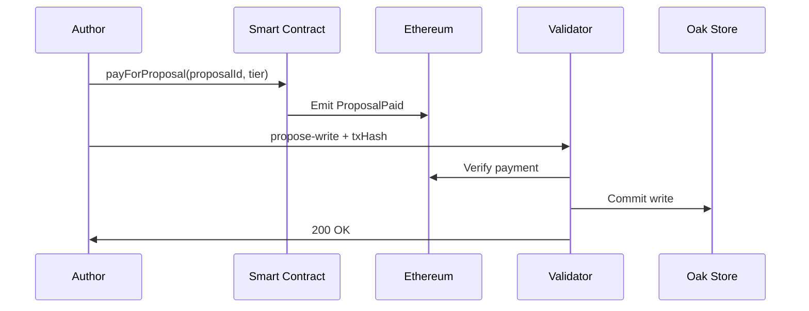

# Economic Tiers

Oak Chain uses Ethereum payments for economic security. Every write is backed by real value.

## Why This Matters

Economic policy controls throughput and trust tradeoffs. Without clear tier use, teams overpay or under-protect critical writes.

## What You'll Prove

- You understand the latency-cost behavior of PRIORITY, EXPRESS, and STANDARD tiers.
- You can map content operations to the correct tier with predictable outcomes.
- You can explain how epoch timing affects write finality.

## Next Action

Pick one real workload, assign a tier, and execute a sample write using the flow and examples below.

## Three Tiers

Current prices below reflect the v1 contract constants in `ValidatorPaymentV3_2`.

| Tier | Latency | ETH Price | USDC Price | Use Case |
|------|---------|-----------|------------|----------|
| **PRIORITY** | ~30s | 0.01 ETH | 32.50 USDC | Breaking news, urgent updates |
| **EXPRESS** | ~6.4min | 0.002 ETH | 6.50 USDC | Standard publishing |
| **STANDARD** | ~12.8min | 0.001 ETH | 3.25 USDC | Batch operations, archives |

## How It Works


```mermaid
sequenceDiagram
    participant A as Author
    participant SC as Smart Contract
    participant ETH as Ethereum
    participant V as Validator
    participant Oak as Oak Store
    
    A->>SC: payForProposal(proposalId, tier)
    SC->>ETH: Emit ProposalPaid
    A->>V: propose-write + txHash
    V->>ETH: Verify payment
    V->>Oak: Commit write
    V->>A: 200 OK
```

## Epoch-Based Finality

Oak Chain uses Ethereum's **epoch** system for finality:

- **Epoch**: 32 slots × 12 seconds = **6.4 minutes**
- **Finality**: 2 epochs = **~12.8 minutes**

### Why Epochs?

1. **Batching**: Multiple writes confirmed in one epoch check
2. **Efficiency**: One Beacon Chain query per epoch, not per write
3. **Security**: Ethereum's economic finality guarantees

## Tier Details

### PRIORITY (~30s)

```bash
curl -X POST http://localhost:8090/v1/propose-write \
  -H "Content-Type: application/x-www-form-urlencoded" \
  -d "walletAddress=0xWALLET" \
  -d "message=Breaking news..." \
  -d "contentType=page" \
  -d "paymentTier=priority" \
  -d "ethereumTxHash=0x..." \
  -d "signature=0x..."
```

- **Bypasses** epoch batching
- **Immediate** payment verification
- **Highest** cost
- **Current price**: 0.01 ETH or 32.50 USDC
- **Use for**: Time-sensitive content

### EXPRESS (~6.4 minutes)

```bash
curl -X POST http://localhost:8090/v1/propose-write \
  -H "Content-Type: application/x-www-form-urlencoded" \
  -d "walletAddress=0xWALLET" \
  -d "message=Article content..." \
  -d "contentType=page" \
  -d "paymentTier=express" \
  -d "ethereumTxHash=0x..." \
  -d "signature=0x..."
```

- **Waits** for current epoch to finalize
- **Batched** with other EXPRESS writes
- **Balanced** cost/latency
- **Current price**: 0.002 ETH or 6.50 USDC
- **Use for**: Normal publishing

### STANDARD (~12.8 minutes)

```bash
curl -X POST http://localhost:8090/v1/propose-write \
  -H "Content-Type: application/x-www-form-urlencoded" \
  -d "walletAddress=0xWALLET" \
  -d "message=Archive content..." \
  -d "contentType=page" \
  -d "paymentTier=standard" \
  -d "ethereumTxHash=0x..." \
  -d "signature=0x..."
```

- **Waits** for 2 epochs (full finality)
- **Maximum** batching efficiency
- **Lowest** cost
- **Current price**: 0.001 ETH or 3.25 USDC
- **Use for**: Bulk imports, archives

## Smart Contract

### ValidatorPaymentV3_2

```solidity
enum Tier { Standard, Express, Priority }

function payForProposal(bytes32 proposalId, Tier tier) external payable;

event ProposalPaid(
    bytes32 indexed proposalId,
    address indexed payer,
    uint256 amount,
    Tier tier,
    PaymentToken indexed paymentToken,
    address preferredValidator,
    uint256 timestamp
);
```

### Payment Verification

Validators verify payments by:

1. Querying Beacon Chain for epoch data
2. Checking `ProposalPaid` events for the configured contract address
3. Matching `txHash` to the observed payment event
4. Verifying the payment is valid for the requested tier

## Pricing Rationale

| Factor | Impact |
|--------|--------|
| **Ethereum gas** | Base cost for payment tx |
| **Validator compute** | Consensus + storage |
| **Replication** | 3+ copies across network |
| **Finality guarantee** | Economic security |

Prices are set to:
- Cover validator operating costs
- Discourage spam
- Remain accessible for legitimate use

Changing those prices requires a contract redeploy.

## Next Steps

- [Consensus Model](/guide/consensus) - How Aeron Raft works
- [Run a Validator](/operators/) - Join the network
