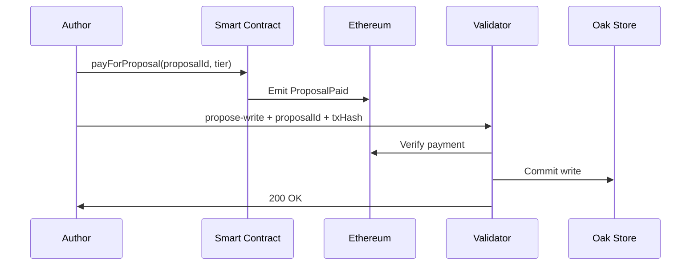

# Economics and Adaptive Release

Oak Chain uses Ethereum payments for economic security. Every write is backed by real value.

## Why This Matters

Economic policy still matters, but release behavior is no longer modeled as fixed tier delays. The current runtime uses an adaptive-capacity scheduler after verification.

## What You'll Prove

- You understand how contract price classes differ from runtime release behavior.
- You can explain why fixed tier delays are deprecated in adaptive-capacity mode.
- You can identify the few cases where `paymentTier` still matters.

## Next Action

Check the live release model with `GET /v1/blockchain/config`, then submit one write using the examples below.

## Contract Price Classes

Current prices below reflect the v1 contract constants in `ValidatorPaymentV3_2`. These are still contract-facing price classes, but they are no longer the primary release scheduler.

| Class | ETH Price | USDC Price | Current Runtime Meaning |
|------|-----------|------------|-------------------------|
| **PRIORITY** | 0.01 ETH | 32.50 USDC | Compatibility price class; may enable direct release after verification if explicitly enabled |
| **EXPRESS** | 0.002 ETH | 6.50 USDC | Compatibility price class; adaptive release has no fixed delay |
| **STANDARD** | 0.001 ETH | 3.25 USDC | Compatibility price class; adaptive release has no fixed delay |

## How It Works


```mermaid
sequenceDiagram
    participant A as Author
    participant SC as Smart Contract
    participant ETH as Ethereum
    participant V as Validator
    participant Oak as Oak Store
    
    A->>SC: payForProposal(proposalId, tier)
    SC->>ETH: Emit ProposalPaid
    A->>V: propose-write + proposalId + txHash
    V->>ETH: Verify payment
    V->>Oak: Commit write
    V->>A: 200 OK
```

## Adaptive Release Model

The runtime now reports the release scheduler as adaptive-capacity. Verified proposals enter an adaptive packing buffer and release when Aeron is healthy, instead of waiting on a fixed per-tier clock.

- `schedulerModel`: `adaptive-capacity`
- `fixedTierDelayDeprecated`: `true`
- `STANDARD` / `EXPRESS`: compatibility price classes with no fixed delay
- `PRIORITY`: compatibility price class; direct release is an optional compatibility entitlement when enabled

Use these runtime surfaces to inspect the live behavior:

- `GET /v1/blockchain/config`
- `GET /v1/proposals/release-flow`

Ethereum epochs still matter for confirmation windows and payment verification, but they are no longer the public mental model for write latency.

## When `paymentTier` Still Matters

For Sepolia/Mainnet, each request reuses the same `proposalId` that was paid for on-chain.

Use `paymentTier` when:

- Your client wants to mirror the contract-facing price class explicitly
- You are using mock-mode simulations that still default through the legacy enum
- You need a priority-only entitlement such as validator-hosted binary upload when that policy is enabled

For ordinary chain-backed writes, the important fields are `proposalId`, `walletAddress`, `message`, `ethereumTxHash`, and `signature`.

## Example Write

```bash
curl -X POST http://localhost:8090/v1/propose-write \
  -H "Content-Type: application/x-www-form-urlencoded" \
  -d "proposalId=0x1111111111111111111111111111111111111111111111111111111111111111" \
  -d "walletAddress=0xWALLET" \
  -d "message=Breaking news..." \
  -d "contentType=page" \
  -d "ethereumTxHash=0x..." \
  -d "signature=0x..."
```

If your client needs to mirror the paid contract class explicitly, include `paymentTier`, but treat it as an economic/compatibility field rather than a latency SLA.

## Smart Contract

### ValidatorPaymentV3_2

```solidity
enum Tier { Standard, Express, Priority }

function payForProposal(bytes32 proposalId, Tier tier) external payable;

event ProposalPaid(
    bytes32 indexed proposalId,
    address indexed payer,
    uint256 amount,
    Tier tier,
    PaymentToken indexed paymentToken,
    address preferredValidator,
    uint256 timestamp
);
```

### Payment Verification

Validators verify payments by:

1. Querying Beacon Chain for epoch data
2. Checking `ProposalPaid` events for the configured contract address
3. Matching `txHash` to the observed payment event
4. Verifying the payment is valid for the paid contract class

## Pricing Rationale

| Factor | Impact |
|--------|--------|
| **Ethereum gas** | Base cost for payment tx |
| **Validator compute** | Consensus + storage |
| **Replication** | 3+ copies across network |
| **Finality guarantee** | Economic security and release-policy guardrails |

Prices are set to:
- Cover validator operating costs
- Discourage spam
- Remain accessible for legitimate use

Changing those prices requires a contract redeploy.

## Next Steps

- [Consensus Model](/guide/consensus) - How Aeron Raft works
- [Run a Validator](/operators/) - Join the network
