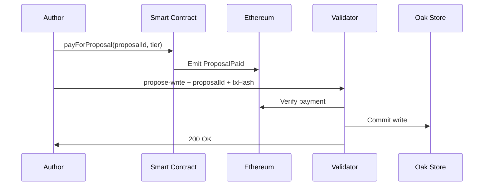

# Economics and Release Model

Oak Chain uses Ethereum payments for economic security. Every write is backed by real value.

## Why This Matters

Oak Chain prices writes through the payment contract and releases verified work through an adaptive packing buffer before Aeron consensus.

## What You'll Prove

- You understand the three payment classes exposed by the contract.
- You understand how verified proposals are packed and released.
- You know which fields matter in a chain-backed write request.

## Next Action

Read the pricing and release model below, then submit one write using the example request.

## Payment Classes

Current prices below reflect the v1 contract constants in `ValidatorPaymentV3_2`.

| Class | ETH Price | USDC Price | Typical Fit |
|------|-----------|------------|-------------|
| **PRIORITY** | 0.01 ETH | 32.50 USDC | Premium or policy-sensitive write flows |
| **EXPRESS** | 0.002 ETH | 6.50 USDC | General publishing flows |
| **STANDARD** | 0.001 ETH | 3.25 USDC | Cost-sensitive bulk or archive flows |

## How It Works


```mermaid
sequenceDiagram
    participant A as Author
    participant SC as Smart Contract
    participant ETH as Ethereum
    participant V as Validator
    participant Oak as Oak Store
    
    A->>SC: payForProposal(proposalId, tier)
    SC->>ETH: Emit ProposalPaid
    A->>V: propose-write + proposalId + txHash
    V->>ETH: Verify payment
    V->>Oak: Commit write
    V->>A: 200 OK
```

## Release Model

After payment proof and signature checks pass, Oak does not simply fire every write straight into Aeron. Verified proposals enter a packing buffer where the runtime:

- groups nearby writes
- organizes them for storage locality
- forms bounded micro-batches
- releases those batches according to live system capacity

That means release timing depends on verification status, queue pressure, and Aeron health, not on a fixed per-class clock.

Use these runtime surfaces when you want to inspect live behavior:

- `GET /v1/blockchain/config`
- `GET /v1/proposals/release-flow`

Ethereum epochs still matter for confirmation windows and payment verification, but they are not the public model for write latency.

## Request Guidance

For Sepolia/Mainnet, each request reuses the same `proposalId` that was paid for on-chain.

For chain-backed writes, the important fields are:

- `proposalId`
- `walletAddress`
- `message`
- `ethereumTxHash`
- `signature`

If your payment flow uses a contract class, send the same `paymentTier` value with the request. It tells Oak which class was paid for, but it should not be interpreted as a latency SLA.

## Example Write

```bash
curl -X POST http://localhost:8090/v1/propose-write \
  -H "Content-Type: application/x-www-form-urlencoded" \
  -d "proposalId=0x1111111111111111111111111111111111111111111111111111111111111111" \
  -d "walletAddress=0xWALLET" \
  -d "message=Breaking news..." \
  -d "contentType=page" \
  -d "paymentTier=express" \
  -d "ethereumTxHash=0x..." \
  -d "signature=0x..."
```

The example includes `paymentTier` because the payment contract was called with a concrete class. Keep the request and payment flow consistent.

## Smart Contract

### ValidatorPaymentV3_2

```solidity
enum Tier { Standard, Express, Priority }

function payForProposal(bytes32 proposalId, Tier tier) external payable;

event ProposalPaid(
    bytes32 indexed proposalId,
    address indexed payer,
    uint256 amount,
    Tier tier,
    PaymentToken indexed paymentToken,
    address preferredValidator,
    uint256 timestamp
);
```

### Payment Verification

Validators verify payments by:

1. Querying Beacon Chain for epoch data
2. Checking `ProposalPaid` events for the configured contract address
3. Matching `txHash` to the observed payment event
4. Verifying the payment is valid for the paid class

## Pricing Rationale

| Factor | Impact |
|--------|--------|
| **Ethereum gas** | Base cost for payment tx |
| **Validator compute** | Consensus + storage |
| **Replication** | 3+ copies across network |
| **Finality guarantee** | Economic security and release discipline |

Prices are set to:
- Cover validator operating costs
- Discourage spam
- Remain accessible for legitimate use

Changing those prices requires a contract redeploy.

## Next Steps

- [Consensus Model](/guide/consensus) - How Aeron Raft works
- [Run a Validator](/operators/) - Join the network
