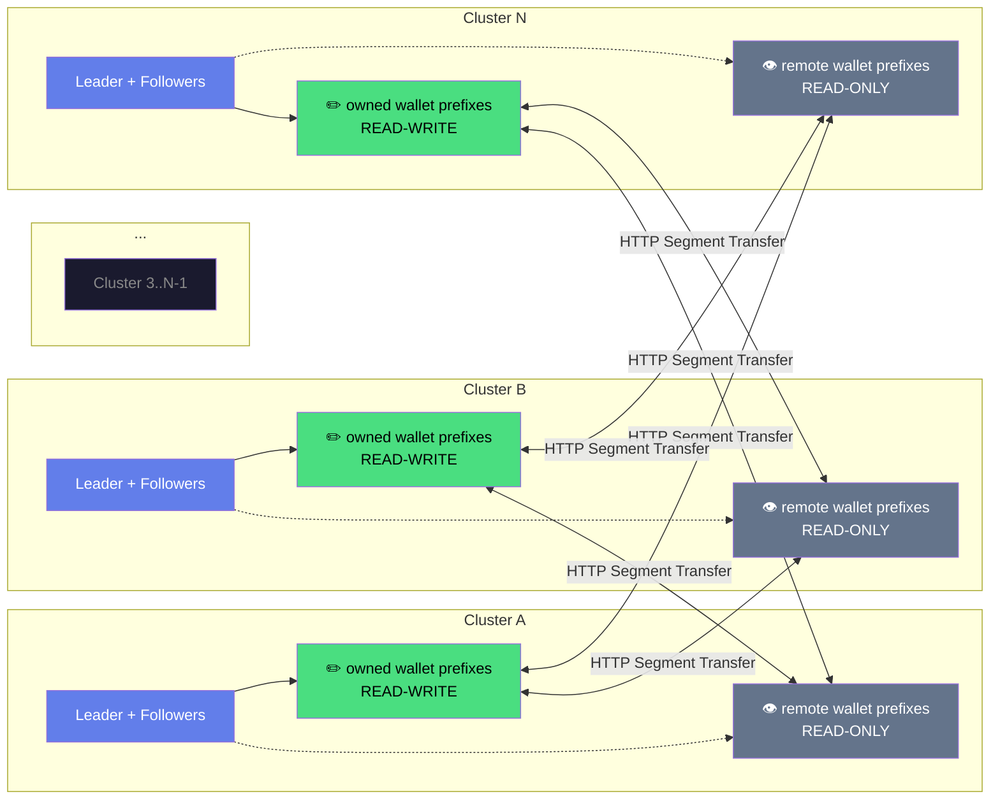

# How Oak Chain Works

Interactive visual diagrams showing the architecture and data flows. **Click nodes** to see details, or hit **Play Animation** to watch data flow through the system.

## Architecture Overview

The complete system: Authors create content (via AEM Connector or SDK), MetaMask handles payments, validators reach consensus, IPFS stores binaries, and Edge Delivery serves content globally.

<FlowGraph flow="architecture" :height="380" />

---

## Content Write Flow

When an author creates or modifies content in Sling, the network first resolves
which cluster owns that wallet namespace. If the request reaches the wrong
cluster, it is redirected before queueing. The authoritative cluster then
accepts the **signed proposal**, replicates it across its own Aeron validators,
and commits it to the local Oak segment store.

<FlowGraph flow="write" :height="420" />

::: tip See the full plate
For the richer sequence boundary and the companion clusters-of-clusters model, open [Write Flow + Content Fabric](/write-flow-and-content-fabric).
:::

### The Steps

1. **Author creates content** via AEM Connector or Oak Chain SDK
2. **Wallet signs** the content change with secp256k1 key
3. **Authority check** resolves the owning cluster for that wallet namespace
4. **Foreign cluster redirects** if the request hit a non-owning cluster
5. **Raft leader** in the authoritative cluster receives and validates the proposal
6. **Log replication** sends entry to local followers
7. **Followers acknowledge** receipt
8. **Commit** happens when the local majority confirms
9. **Oak Store** persists content to TAR segments

---

## Payment Flow

Users pay for content writes via a wallet such as **MetaMask**.
The payment goes to the `ValidatorPaymentV3_2` contract on Ethereum.
That contract emits a `ProposalPaid` event.
Validators monitor those events and authorize writes for the paying wallet address.

<FlowGraph flow="payment" :height="380" />

### Payment Tiers

| Tier | Confirmation Time | Current V1 Price | Use Case |
|------|-------------------|------------------|----------|
| **Priority** | ~30 seconds | 0.01 ETH or 32.50 USDC | Breaking news, urgent updates |
| **Express** | ~6.4 minutes | 0.002 ETH or 6.50 USDC | Standard publishing |
| **Standard** | ~12.8 minutes | 0.001 ETH or 3.25 USDC | Batch operations, archives |

---

## IPFS Binary Storage

Binary assets (images, PDFs, videos) are stored on **IPFS**, not in Oak segments. The author's local IPFS node pins the content and generates a **CID** (content-addressed hash). Oak stores only the CID reference, enabling global retrieval via any IPFS gateway.

<FlowGraph flow="ipfs" :height="380" />

### Why IPFS for Binaries?

- **Content-addressed**: Same content = same CID, automatic deduplication
- **Author-owned storage**: Validators don't store binaries, just CID references
- **Global availability**: Any IPFS gateway can serve the content
- **Immutable**: CID is a cryptographic hash of the content

---

## Raft Consensus State Machine

Validators use **Aeron Raft** for consensus. Nodes start as Followers, become Candidates on election timeout, and Leaders if they win majority votes. Leaders send heartbeats to maintain authority.

<FlowGraph flow="consensus" :height="420" />

### State Transitions

| From | To | Trigger |
|------|-----|---------|
| **Follower** | Candidate | Election timeout (no heartbeat) |
| **Candidate** | Leader | Receives majority votes |
| **Candidate** | Follower | Discovers higher term |
| **Leader** | Follower | Discovers higher term |

### Timing

- **Heartbeat interval**: 50ms
- **Election timeout**: 150-300ms (randomized)
- **Failover time**: Sub-second

---

## The Complete Picture

```
┌─────────────────────────────────────────────────────────────┐
│                    AUTHORING LAYER                          │
│  AEM Connector / Oak Chain SDK + MetaMask Wallet            │
└─────────────────────────────────────────────────────────────┘
                           │
                           ▼
┌─────────────────────────────────────────────────────────────┐
│                    CONSENSUS LAYER                          │
│  Aeron Raft Cluster (Leader + Followers)                    │
│  • Signed write proposals                                   │
│  • Payment verification via Ethereum                        │
│  • Deterministic state machine                              │
└─────────────────────────────────────────────────────────────┘
                           │
                           ▼
┌─────────────────────────────────────────────────────────────┐
│                    STORAGE LAYER                            │
│  Oak Segment Store (TAR files) + IPFS (binaries)            │
│  • Immutable segments                                       │
│  • Append-only journal                                      │
│  • Content-addressed binaries                               │
└─────────────────────────────────────────────────────────────┘
                           │
                           ▼
┌─────────────────────────────────────────────────────────────┐
│                    DELIVERY LAYER                           │
│  Edge Delivery Services (CDN)                               │
│  • 100 Lighthouse score                                     │
│  • Global distribution                                      │
│  • Real-time streaming                                      │
└─────────────────────────────────────────────────────────────┘
```

## Key Principles

1. **Wallet = Identity**: Every participant has an Ethereum wallet
2. **Signed Proposals**: Every write is cryptographically signed
3. **Payment = Authorization**: No payment, no write
4. **Consensus = Truth**: Majority agreement determines state
5. **Immutable Storage**: Once written, content is permanent

### Why These Principles?

We didn't choose these arbitrarily. We broke down to fundamentals:

- **What is identity?** → Cryptographic proof (wallet), not username/password
- **What is authorization?** → Economic proof (payment), not role-based access
- **What is truth?** → Consensus (majority), not single-authority
- **What is persistence?** → Immutable (append-only), not mutable databases

We reasoned up from these atoms. The result: a system that's fundamentally different from traditional CMS, but built on proven primitives (Ethereum, Oak, Raft).

---

## Cluster Topology

The network scales horizontally through multiple clusters. Each cluster is a
sovereign Aeron-backed fiefdom over a portion of the wallet namespace: one
local writable repository, plus lazy read-only views of remote clusters.


```mermaid
graph LR
    subgraph ClusterA["Cluster A"]
        direction TB
        LA[Leader + Followers]
        SA["✏️ owned wallet prefixes<br/>READ-WRITE"]
        MA["👁️ remote wallet prefixes<br/>READ-ONLY"]
        LA --> SA
        LA -.-> MA
    end
    
    subgraph ClusterB["Cluster B"]
        direction TB
        LB[Leader + Followers]
        SB["✏️ owned wallet prefixes<br/>READ-WRITE"]
        MB["👁️ remote wallet prefixes<br/>READ-ONLY"]
        LB --> SB
        LB -.-> MB
    end
    
    subgraph ClusterDots["..."]
        direction TB
        LD["Cluster 3..N-1"]
    end
    
    subgraph ClusterN["Cluster N"]
        direction TB
        LN[Leader + Followers]
        SN["✏️ owned wallet prefixes<br/>READ-WRITE"]
        MN["👁️ remote wallet prefixes<br/>READ-ONLY"]
        LN --> SN
        LN -.-> MN
    end
    
    SA <-->|"HTTP Segment Transfer"| MB
    SA <-->|"HTTP Segment Transfer"| MN
    SB <-->|"HTTP Segment Transfer"| MA
    SB <-->|"HTTP Segment Transfer"| MN
    SN <-->|"HTTP Segment Transfer"| MA
    SN <-->|"HTTP Segment Transfer"| MB
    
    style SA fill:#4ade80,color:#000
    style SB fill:#4ade80,color:#000
    style SN fill:#4ade80,color:#000
    style MA fill:#64748b,color:#fff
    style MB fill:#64748b,color:#fff
    style MN fill:#64748b,color:#fff
    style LA fill:#627EEA,color:#fff
    style LB fill:#627EEA,color:#fff
    style LN fill:#627EEA,color:#fff
    style LD fill:#1a1a2e,color:#888
```

**Each cluster is sovereign over its own shard, but mounts remote shards
read-only. Consensus stays local.**

| | Cluster A | Cluster B |
|---|-----------|-----------|
| **Writes** | `/oak-chain/00-7F/*` | `/oak-chain/80-FF/*` |
| **Reads** | Everything | Everything |

- **Wallet 0x74...** → prefix `74/...` falls in Cluster A's owned range → **Cluster A** is authoritative
- **Wallet 0xAB...** → prefix `ab/...` falls in Cluster B's owned range → **Cluster B** is authoritative

Authors write to their authoritative cluster. All clusters can read all content.

### Three Operational Planes

- **Intra-cluster consensus**: Aeron/Raft governs the local writable
  repository only.
- **Cross-cluster reads**: remote content is mounted lazily and read-only over
  HTTP segment transfer.
- **Discovery**: cluster announcements and route hints are a separate control
  plane, not part of consensus.

For the wider three-plane visual, open [Write Flow + Content Fabric](/write-flow-and-content-fabric).

### Scaling

The architecture scales horizontally by adding clusters:

| Clusters | Shards/Cluster | Wallets Supported | Read Mounts/Cluster |
|----------|----------------|-------------------|---------------------|
| **2** | 128 shards | ~8M wallets | 1 mount |
| **20** | 12-13 shards | ~80M wallets | 19 mounts |
| **50** | 5 shards | ~200M wallets | 49 mounts |
| **100** | 2-3 shards | ~400M wallets | 99 mounts |
| **1,000** | 16 shards* | ~4B wallets | 999 mounts |

*At 1,000 clusters, shards are subdivided further (L4 sharding).

### Trade-offs at Scale

| Scale | Writes | Reads | Sync Overhead |
|-------|--------|-------|---------------|
| **Small (2-20)** | Fast | Fast | Low |
| **Medium (50-100)** | Fast | Fast | Moderate |
| **Large (1,000+)** | Fast | Fast | High (optimized via gossip) |

**Key insight**: Write throughput scales linearly (each cluster handles its shard independently). Read latency stays constant (local mount). Sync overhead grows with cluster count but is optimized via:
- Lazy segment fetching (pull on demand)
- Announcement/gossip-based discovery and mount refresh
- Hierarchical sync topology

---

## Deep Dive: Segment Store GC

The append-only segment store accumulates garbage over time. Learn how Oak's **generational garbage collection** reclaims disk space while maintaining data integrity.

<div style="text-align: center; margin: 2rem 0;">
  <a href="/oak-chain-docs/segment-gc" class="action-btn secondary">🗑️ Segment Store GC →</a>
</div>

<style>
.action-btn.secondary {
  background: linear-gradient(135deg, #4ade80, #22c55e);
}
</style>

---

<div style="text-align: center; margin-top: 3rem;">
  <a href="/oak-chain-docs/guide/" class="action-btn">Get Started →</a>
</div>

<style>
.action-btn {
  display: inline-block;
  padding: 12px 28px;
  background: linear-gradient(135deg, #4a5fd9, #627EEA);
  color: #fff;
  border-radius: 8px;
  font-weight: 700;
  text-decoration: none;
  transition: all 0.2s ease;
  text-shadow: 0 1px 2px rgba(0, 0, 0, 0.3);
}
.action-btn:hover {
  transform: translateY(-2px);
  box-shadow: 0 8px 24px rgba(98, 126, 234, 0.4);
  background: linear-gradient(135deg, #3a4fc9, #5a6eda);
}
</style>
