# How Oak Chain Works

Interactive visual diagrams showing the architecture and data flows. **Click nodes** to see details, or hit **Play Animation** to watch data flow through the system.

## Architecture Overview

The complete system: Authors create content (via AEM Connector or SDK), MetaMask handles payments, validators reach consensus, IPFS stores binaries, and Edge Delivery serves content globally.

<FlowGraph flow="architecture" :height="380" />

---

## Content Write Flow

When an author creates or modifies content in Sling, the change is **signed with their wallet**, submitted as a proposal to the Raft leader, **replicated across validators**, and committed to the Oak segment store. Every write is cryptographically signed and consensus-verified.

<FlowGraph flow="write" :height="420" />

### The Steps

1. **Author creates content** via AEM Connector or Oak Chain SDK
2. **Wallet signs** the content change with secp256k1 key
3. **Write proposal** is created with signature
4. **Raft leader** receives and validates the proposal
5. **Log replication** sends entry to all followers
6. **Followers acknowledge** receipt
7. **Commit** happens when majority confirms
8. **Oak Store** persists content to TAR segments

---

## Payment Flow

Users pay for content writes via **MetaMask**. The payment goes to a smart contract on Ethereum (Sepolia testnet), which emits an event. Validators monitor these events and **authorize writes** for the paying wallet address.

<FlowGraph flow="payment" :height="380" />

### Payment Tiers

| Tier | Confirmation Time | Use Case |
|------|-------------------|----------|
| **Priority** | ~30 seconds | Breaking news, urgent updates |
| **Express** | ~6.4 minutes | Standard publishing |
| **Standard** | ~12.8 minutes | Batch operations, archives |

---

## IPFS Binary Storage

Binary assets (images, PDFs, videos) are stored on **IPFS**, not in Oak segments. The author's local IPFS node pins the content and generates a **CID** (content-addressed hash). Oak stores only the CID reference, enabling global retrieval via any IPFS gateway.

<FlowGraph flow="ipfs" :height="380" />

### Why IPFS for Binaries?

- **Content-addressed**: Same content = same CID, automatic deduplication
- **Author-owned storage**: Validators don't store binaries, just CID references
- **Global availability**: Any IPFS gateway can serve the content
- **Immutable**: CID is a cryptographic hash of the content

---

## Raft Consensus State Machine

Validators use **Aeron Raft** for consensus. Nodes start as Followers, become Candidates on election timeout, and Leaders if they win majority votes. Leaders send heartbeats to maintain authority.

<FlowGraph flow="consensus" :height="420" />

### State Transitions

| From | To | Trigger |
|------|-----|---------|
| **Follower** | Candidate | Election timeout (no heartbeat) |
| **Candidate** | Leader | Receives majority votes |
| **Candidate** | Follower | Discovers higher term |
| **Leader** | Follower | Discovers higher term |

### Timing

- **Heartbeat interval**: 50ms
- **Election timeout**: 150-300ms (randomized)
- **Failover time**: Sub-second

---

## The Complete Picture

```
┌─────────────────────────────────────────────────────────────┐
│                    AUTHORING LAYER                          │
│  AEM Connector / Oak Chain SDK + MetaMask Wallet            │
└─────────────────────────────────────────────────────────────┘
                           │
                           ▼
┌─────────────────────────────────────────────────────────────┐
│                    CONSENSUS LAYER                          │
│  Aeron Raft Cluster (Leader + Followers)                    │
│  • Signed write proposals                                   │
│  • Payment verification via Ethereum                        │
│  • Deterministic state machine                              │
└─────────────────────────────────────────────────────────────┘
                           │
                           ▼
┌─────────────────────────────────────────────────────────────┐
│                    STORAGE LAYER                            │
│  Oak Segment Store (TAR files) + IPFS (binaries)            │
│  • Immutable segments                                       │
│  • Append-only journal                                      │
│  • Content-addressed binaries                               │
└─────────────────────────────────────────────────────────────┘
                           │
                           ▼
┌─────────────────────────────────────────────────────────────┐
│                    DELIVERY LAYER                           │
│  Edge Delivery Services (CDN)                               │
│  • 100 Lighthouse score                                     │
│  • Global distribution                                      │
│  • Real-time streaming                                      │
└─────────────────────────────────────────────────────────────┘
```

## Key Principles

1. **Wallet = Identity**: Every participant has an Ethereum wallet
2. **Signed Proposals**: Every write is cryptographically signed
3. **Payment = Authorization**: No payment, no write
4. **Consensus = Truth**: Majority agreement determines state
5. **Immutable Storage**: Once written, content is permanent

---

## Cluster Topology

The network scales horizontally through multiple clusters, each sovereign over a shard of wallet addresses.

```mermaid
graph LR
    subgraph ClusterA["Cluster A"]
        direction TB
        LA[Leader + Followers]
        SA["✏️ /oak-chain/00-3F/*<br/>READ-WRITE"]
        MA["👁️ /oak-chain/40-FF/*<br/>READ-ONLY"]
        LA --> SA
        LA -.-> MA
    end
    
    subgraph ClusterB["Cluster B"]
        direction TB
        LB[Leader + Followers]
        SB["✏️ /oak-chain/40-7F/*<br/>READ-WRITE"]
        MB["👁️ /oak-chain/00-3F,80-FF/*<br/>READ-ONLY"]
        LB --> SB
        LB -.-> MB
    end
    
    subgraph ClusterDots["..."]
        direction TB
        LD["Cluster 3..N-1"]
    end
    
    subgraph ClusterN["Cluster N"]
        direction TB
        LN[Leader + Followers]
        SN["✏️ /oak-chain/C0-FF/*<br/>READ-WRITE"]
        MN["👁️ /oak-chain/00-BF/*<br/>READ-ONLY"]
        LN --> SN
        LN -.-> MN
    end
    
    SA <-->|"HTTP Segment Transfer"| MB
    SA <-->|"HTTP Segment Transfer"| MN
    SB <-->|"HTTP Segment Transfer"| MA
    SB <-->|"HTTP Segment Transfer"| MN
    SN <-->|"HTTP Segment Transfer"| MA
    SN <-->|"HTTP Segment Transfer"| MB
    
    style SA fill:#4ade80,color:#000
    style SB fill:#4ade80,color:#000
    style SN fill:#4ade80,color:#000
    style MA fill:#64748b,color:#fff
    style MB fill:#64748b,color:#fff
    style MN fill:#64748b,color:#fff
    style LA fill:#627EEA,color:#fff
    style LB fill:#627EEA,color:#fff
    style LN fill:#627EEA,color:#fff
    style LD fill:#1a1a2e,color:#888
```



**Each cluster is sovereign over its shard, but mounts all others read-only.**

| | Cluster A | Cluster B |
|---|-----------|-----------|
| **Writes** | `/oak-chain/00-7F/*` | `/oak-chain/80-FF/*` |
| **Reads** | Everything | Everything |

- **Wallet 0x74...** → hash maps to shard `74` → **Cluster A** is authoritative
- **Wallet 0xAB...** → hash maps to shard `AB` → **Cluster B** is authoritative

Authors write to their authoritative cluster. All clusters can read all content.

### Scaling

The architecture scales horizontally by adding clusters:

| Clusters | Shards/Cluster | Wallets Supported | Read Mounts/Cluster |
|----------|----------------|-------------------|---------------------|
| **2** | 128 shards | ~8M wallets | 1 mount |
| **20** | 12-13 shards | ~80M wallets | 19 mounts |
| **50** | 5 shards | ~200M wallets | 49 mounts |
| **100** | 2-3 shards | ~400M wallets | 99 mounts |
| **1,000** | 16 shards* | ~4B wallets | 999 mounts |

*At 1,000 clusters, shards are subdivided further (L4 sharding).

### Trade-offs at Scale

| Scale | Writes | Reads | Sync Overhead |
|-------|--------|-------|---------------|
| **Small (2-20)** | Fast | Fast | Low |
| **Medium (50-100)** | Fast | Fast | Moderate |
| **Large (1,000+)** | Fast | Fast | High (optimized via gossip) |

**Key insight**: Write throughput scales linearly (each cluster handles its shard independently). Read latency stays constant (local mount). Sync overhead grows with cluster count but is optimized via:
- Lazy segment fetching (pull on demand)
- Gossip-based journal propagation
- Hierarchical sync topology

---

## Deep Dive: Segment Store GC

The append-only segment store accumulates garbage over time. Learn how Oak's **generational garbage collection** reclaims disk space while maintaining data integrity.

<div style="text-align: center; margin: 2rem 0;">
  <a href="./segment-gc" class="action-btn secondary">🗑️ Segment Store GC →</a>
</div>

<style>
.action-btn.secondary {
  background: linear-gradient(135deg, #4ade80, #22c55e);
}
</style>

---

<div style="text-align: center; margin-top: 3rem;">
  <a href="/guide/" class="action-btn">Get Started →</a>
</div>

<style>
.action-btn {
  display: inline-block;
  padding: 12px 28px;
  background: linear-gradient(135deg, #4a5fd9, #627EEA);
  color: #fff;
  border-radius: 8px;
  font-weight: 700;
  text-decoration: none;
  transition: all 0.2s ease;
  text-shadow: 0 1px 2px rgba(0, 0, 0, 0.3);
}
.action-btn:hover {
  transform: translateY(-2px);
  box-shadow: 0 8px 24px rgba(98, 126, 234, 0.4);
  background: linear-gradient(135deg, #3a4fc9, #5a6eda);
}
</style>
