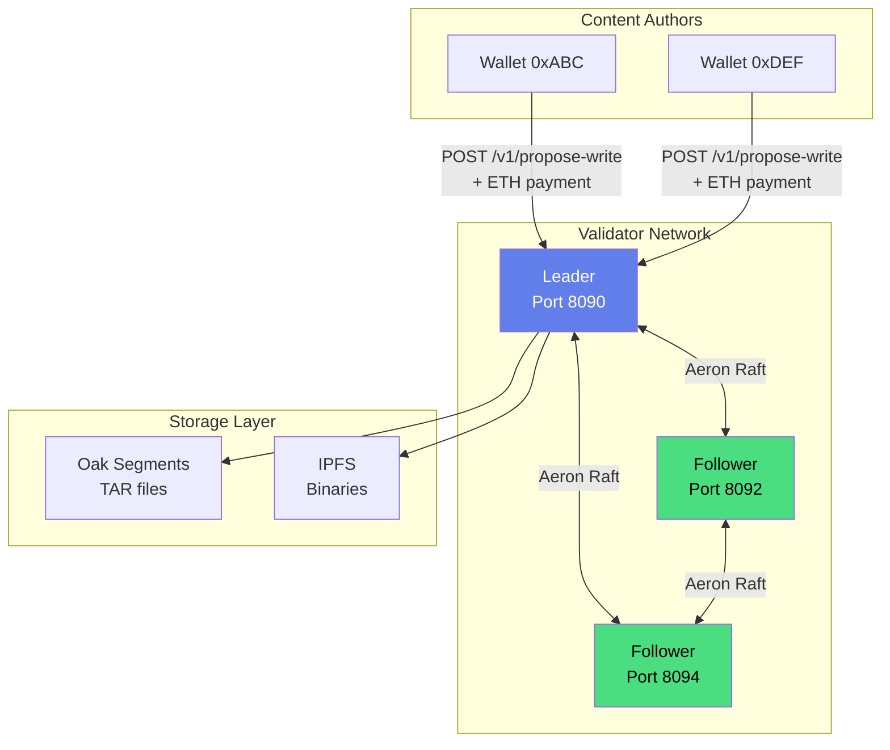

## How It Works

## The Model

1. **Author signs** content with Ethereum wallet
2. **Author pays** via smart contract (ETH)
3. **Leader validates** payment on Ethereum
4. **Leader proposes** write to Aeron cluster
5. **Followers replicate** via Raft consensus
6. **Content persists** in Oak segment store
7. **Binaries stored** in IPFS (CID in Oak)

Every write is cryptographically signed, economically backed, and replicated across the validator network.

## Quick Links

- [**Architecture Overview**](/architecture) - How the system works
- [**Quick Start**](/guide/) - Get running in 10 minutes
- [**Run a Validator**](/operators/) - Join the network
