## How It Works

```mermaid
graph LR
    subgraph ClusterA["Cluster A"]
        direction TB
        LA[Leader + Followers]
        SA["✏️ /oak-chain/00-7F/*<br/>READ-WRITE"]
        MA["👁️ /oak-chain/80-FF/*<br/>READ-ONLY"]
        LA --> SA
        LA -.-> MA
    end
    
    subgraph ClusterB["Cluster B"]
        direction TB
        LB[Leader + Followers]
        SB["✏️ /oak-chain/80-FF/*<br/>READ-WRITE"]
        MB["👁️ /oak-chain/00-7F/*<br/>READ-ONLY"]
        LB --> SB
        LB -.-> MB
    end
    
    SA -->|"HTTP Segment Transfer"| MB
    SB -->|"HTTP Segment Transfer"| MA
    
    style SA fill:#4ade80,color:#000
    style SB fill:#4ade80,color:#000
    style MA fill:#64748b,color:#fff
    style MB fill:#64748b,color:#fff
    style LA fill:#627EEA,color:#fff
    style LB fill:#627EEA,color:#fff
```

**Each cluster is sovereign over its shard, but mounts all others read-only.**

| | Cluster A | Cluster B |
|---|-----------|-----------|
| **Writes** | `/oak-chain/00-7F/*` | `/oak-chain/80-FF/*` |
| **Reads** | Everything | Everything |

- **Wallet 0x74...** → hash maps to shard `74` → **Cluster A** is authoritative
- **Wallet 0xAB...** → hash maps to shard `AB` → **Cluster B** is authoritative

Authors write to their authoritative cluster. All clusters can read all content.

## Scaling

The architecture scales horizontally by adding clusters:

| Clusters | Shards/Cluster | Wallets Supported | Read Mounts/Cluster |
|----------|----------------|-------------------|---------------------|
| **2** | 128 shards | ~8M wallets | 1 mount |
| **20** | 12-13 shards | ~80M wallets | 19 mounts |
| **50** | 5 shards | ~200M wallets | 49 mounts |
| **100** | 2-3 shards | ~400M wallets | 99 mounts |
| **1,000** | 16 shards* | ~4B wallets | 999 mounts |

*At 1,000 clusters, shards are subdivided further (L4 sharding).

### Trade-offs at Scale

| Scale | Writes | Reads | Sync Overhead |
|-------|--------|-------|---------------|
| **Small (2-20)** | Fast | Fast | Low |
| **Medium (50-100)** | Fast | Fast | Moderate |
| **Large (1,000+)** | Fast | Fast | High (optimized via gossip) |

**Key insight**: Write throughput scales linearly (each cluster handles its shard independently). Read latency stays constant (local mount). Sync overhead grows with cluster count but is optimized via:
- Lazy segment fetching (pull on demand)
- Gossip-based journal propagation
- Hierarchical sync topology

## The Model

1. **Author signs** content with Ethereum wallet
2. **Author pays** via smart contract (ETH)
3. **Router determines** which cluster owns the wallet's shard
4. **Leader validates** payment on Ethereum
5. **Leader proposes** write to Aeron cluster
6. **Followers replicate** via Raft consensus
7. **Content persists** in Oak segment store
8. **Binaries stored** in IPFS (CID in Oak)
9. **Cross-cluster reads** via HTTP segment transfer

Every write is cryptographically signed, economically backed, and replicated. Wallets are deterministically sharded across clusters for horizontal scalability.

## Quick Links

- [**Architecture Overview**](/architecture) - How the system works
- [**Quick Start**](/guide/) - Get running in 10 minutes
- [**Run a Validator**](/operators/) - Join the network

---

  
  
Jackrabbit Oak meets Blockchain

