## How It Works

```mermaid
graph TB
    subgraph Authors["Content Authors"]
        A1["Wallet 0x74...<br/>(Shard 74-2d-35)"]
        A2["Wallet 0xAB...<br/>(Shard ab-cd-ef)"]
    end
    
    subgraph Router["Deterministic Routing"]
        R[hash wallet → shard → cluster]
    end
    
    subgraph C1["Cluster A (Shards 00-7F)"]
        L1[Leader]
        F1a[Follower]
        F1b[Follower]
        L1 <-->|Raft| F1a
        L1 <-->|Raft| F1b
    end
    
    subgraph C2["Cluster B (Shards 80-FF)"]
        L2[Leader]
        F2a[Follower]
        F2b[Follower]
        L2 <-->|Raft| F2a
        L2 <-->|Raft| F2b
    end
    
    subgraph Storage["Storage Layer"]
        OAK[Oak Segments]
        IPFS[IPFS Binaries]
    end
    
    A1 -->|"+ ETH payment"| R
    A2 -->|"+ ETH payment"| R
    R -->|"0x74... → Cluster A"| L1
    R -->|"0xAB... → Cluster B"| L2
    
    C1 <-->|"HTTP Segment Transfer<br/>(Cross-Cluster Reads)"| C2
    
    L1 --> OAK
    L2 --> OAK
    L1 --> IPFS
    L2 --> IPFS
    
    style L1 fill:#627EEA,color:#fff
    style L2 fill:#627EEA,color:#fff
    style F1a fill:#4ade80,color:#000
    style F1b fill:#4ade80,color:#000
    style F2a fill:#4ade80,color:#000
    style F2b fill:#4ade80,color:#000
    style R fill:#8C8DFC,color:#fff
```

## The Model

1. **Author signs** content with Ethereum wallet
2. **Author pays** via smart contract (ETH)
3. **Router determines** which cluster owns the wallet's shard
4. **Leader validates** payment on Ethereum
5. **Leader proposes** write to Aeron cluster
6. **Followers replicate** via Raft consensus
7. **Content persists** in Oak segment store
8. **Binaries stored** in IPFS (CID in Oak)
9. **Cross-cluster reads** via HTTP segment transfer

Every write is cryptographically signed, economically backed, and replicated. Wallets are deterministically sharded across clusters for horizontal scalability.

## Quick Links

- [**Architecture Overview**](/architecture) - How the system works
- [**Quick Start**](/guide/) - Get running in 10 minutes
- [**Run a Validator**](/operators/) - Join the network

---

  
  
Jackrabbit Oak meets Blockchain

